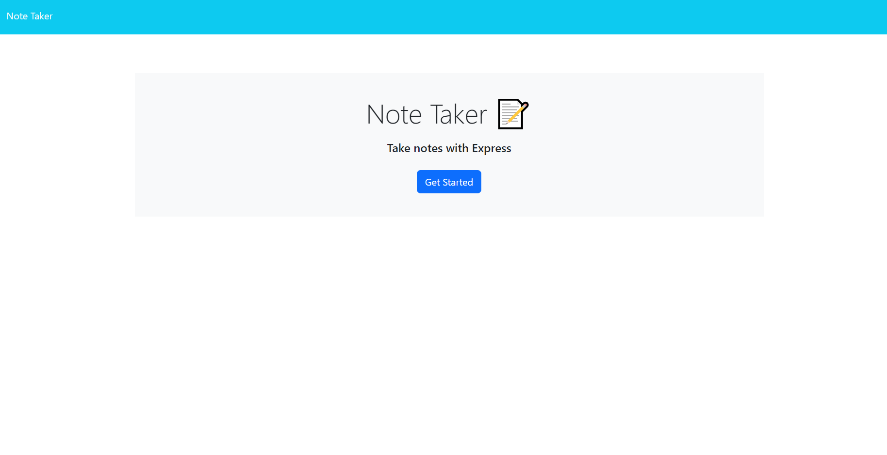
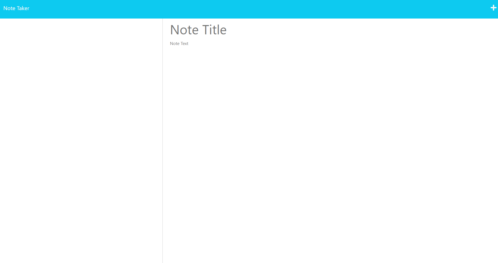

# Express Note Taker

This project involves connecting two html files using express.js. The user is prompted with a home page with a button in the middle that allows them to access their notes. When the user clicks the button they are taken to a notes.html file using express. They are then able to write new notes with the ability to save and delete those notes. 

## Express Note Taker FAQ

##### What is the Express Note Taker project?

The Express Note Taker project is a web application that utilizes the Express.js framework to connect two HTML files and provide users with a seamless note-taking experience. The project aims to simplify the process of creating, saving, and deleting notes for users.

### How does the project work?

1. Home Page: The project starts with a home page that displays a button in the middle. This button serves as a link to access the user's notes.

2. Notes Page: When the user clicks the button on the home page, they are redirected to a `notes.html` file using the Express.js framework. This page allows users to view and manage their notes.

3. Note Creation: On the `notes.html` page, users have the option to create new notes or access notes they previously wrote. They can input a title and a body for each note they create.

4. Note Saving: After writing a note, users can save it using the save button in the top right corner. The Express.js backend handles the logic to save the note data in a db.json file, ensuring that it's stored securely and retrievable later.

### What technologies are used in the project?

- **Express.js**: This framework is used to create a server and manage routes, enabling the connection between the home page, the notes page, and the backend logic.

- **HTML**: The project relies on HTML files for the user interface. The home `index.html` and the `notes.html` page.

- **CSS**: Styling is applied using CSS to enhance the visual appeal and user experience of the application.

### How can I run the project?

1. Clone the project repository from [GitHub Repository URL](https://github.com/cody-and/express-note-taker).

2. Open a terminal and navigate to the project directory.

3. Run the command `npm i` to install the necessary dependencies.

4. Start the server using the command `node server.js`.

5. Open a web browser and go to `http://localhost:3001` to access the home page of the project.

6. Click the button on the home page to navigate to the notes page and start creating and managing your notes.

## Screenshots

